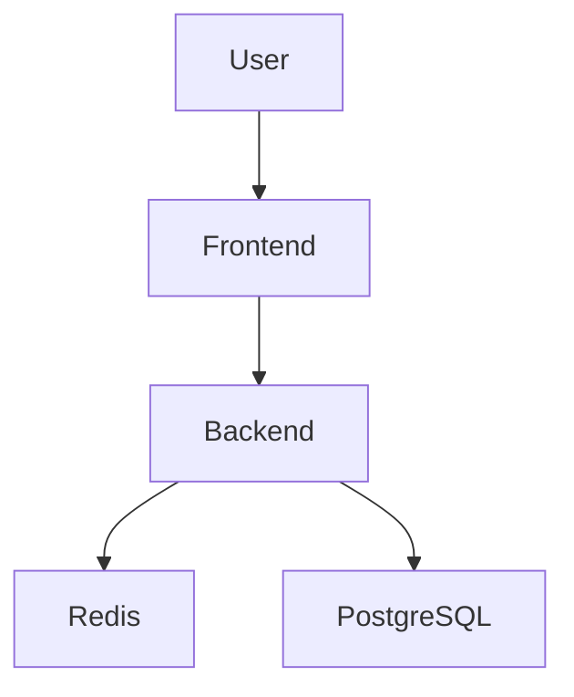
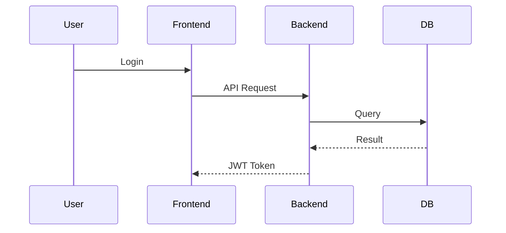
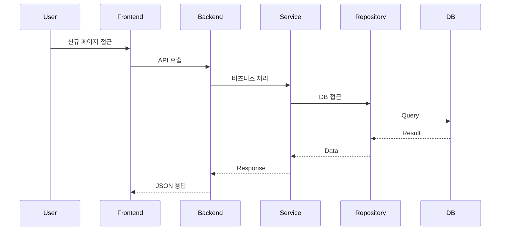

# 프로젝트 구조 분석 문서 생성 프롬프트

너는 시니어 소프트웨어 아키텍트이자 시스템 분석가이다.

아래 프로젝트의 구조를 분석하여
"프로젝트 구조 분석 문서"를 작성해라.

문서는 실무 설계 문서 수준으로 작성하며,
신규 개발자 또는 운영자가 프로젝트를 빠르게 이해할 수 있도록 구성해야 한다.

---

# 목표

- Frontend → Backend → Database 까지의 전체 흐름 파악
- 사용자 요청 흐름 정리
- 인증/인가 흐름 정리
- Layer 구조 분석
- API 호출 흐름 분석
- 데이터 흐름 분석
- 프로젝트의 역할과 책임 정리
- 장애 포인트 및 개선 포인트 파악
- 신규 기능 추가 흐름 파악
- 한눈에 보기 쉬운 구조도 제공

---

# 반드시 포함할 항목

## 1. 프로젝트 개요

다음을 정리해라.

- 프로젝트 목적
- 주요 기능
- 기술 스택
- 시스템 구성
- 서비스 특징
- 핵심 도메인
- 사용자 유형
- 운영 환경

---

## 2. 전체 시스템 아키텍처

다음 내용을 포함하여 설명해라.

- Frontend
- Backend
- API Gateway
- Auth Server
- Redis
- Database
- Queue
- External API
- Storage
- CDN
- Load Balancer
- Docker/Nginx 구조

그리고 반드시 Mermaid Diagram 으로 시각화해라.

예시:



---

## 3. Frontend 구조 분석

다음을 분석해라.

- Routing 구조
- SSR / CSR 여부
- 상태관리 구조
- API 호출 방식
- Middleware 동작
- 인증 처리 방식
- Token 저장 위치
- Page 진입 흐름
- Component 구조
- Layout 구조
- 권한 체크 흐름
- Error 처리 흐름
- Loading 처리 방식
- 공통 UI 구조
- Hook 사용 구조

그리고 사용자 페이지 진입 흐름을 Mermaid 로 그려라.

---

## 4. Backend 구조 분석

다음을 분석해라.

- Controller
- Service
- Repository
- Domain
- DTO
- Entity
- Middleware / Filter
- Exception 처리
- Logging 처리
- Transaction 처리
- Cache 처리
- Async 처리
- Scheduler 처리
- MQ 사용 여부
- Validation 처리
- Config 구조
- Util/Common 구조

레이어별 책임을 표로 정리해라.

---

## 5. 인증 / 인가 Flow 분석

반드시 아래 항목 포함:

- 로그인 처리 흐름
- JWT 처리 흐름
- Refresh Token 흐름
- Access Token 재발급 흐름
- Session 사용 여부
- Cookie 전략
- CSRF 전략
- 권한(Role) 처리 방식
- API 인증 방식
- Middleware 인증 흐름
- 메뉴 권한 처리
- 페이지 권한 처리

그리고 반드시 인증 Flow Diagram 을 Mermaid 로 작성해라.

---

## 6. API 흐름 분석

다음을 정리해라.

- Front → API 요청 흐름
- 인증 헤더 흐름
- Backend 내부 처리 흐름
- DB 접근 흐름
- Cache 접근 흐름
- Error 처리 흐름
- Logging 흐름
- Retry 처리 여부
- Timeout 처리 여부

예시:



---

## 7. Database 분석

다음을 분석해라.

- 주요 테이블
- 관계 구조
- 트랜잭션 처리
- 인덱스 전략
- Lock 가능성
- 성능 병목
- Redis Cache 전략
- 데이터 정합성 전략
- Soft Delete 여부
- Audit 처리 여부

ERD 스타일 Mermaid Diagram 작성.

---

## 8. 배포 구조 분석

다음을 포함:

- Docker 구성
- Docker Compose 구조
- Nginx Reverse Proxy
- HTTPS 처리
- CI/CD 구조
- GitHub Actions 구조
- 환경 변수 관리
- 로그 관리
- 운영/개발 환경 분리
- Scale-Out 전략
- 무중단 배포 여부

배포 흐름 Diagram 작성.

---

## 9. 성능 및 장애 포인트 분석

반드시 포함:

- 병목 가능성
- 메모리 사용 포인트
- DB 병목
- API 병목
- 캐시 전략 문제
- 동시성 이슈
- 인증 병목
- Scale-Out 전략
- 보안 위험 요소
- Redis 장애 가능성
- DeadLock 가능성
- API Timeout 위험
- Queue 적체 가능성

그리고 개선 방안을 제시해라.

---

## 10. 신규 기능 추가 가이드

새로운 페이지 또는 기능 추가 시
어떤 위치에 어떤 파일을 생성/수정해야 하는지
실무 개발 흐름 기준으로 단계별 설명을 작성해라.

---

### 10-1. Frontend 작업 흐름

다음을 설명:

- 신규 Page 생성 위치
- Route 등록 위치
- Layout 연결 방식
- 메뉴 추가 위치
- 상태관리(Store) 추가 위치
- API Client 생성 위치
- 공통 Component 사용 위치
- 권한 체크 추가 위치
- Middleware 수정 여부
- 환경 변수 추가 위치

예시 디렉토리 구조 포함:

```text
frontend/
 ├─ app/
 ├─ components/
 ├─ services/
 ├─ stores/
 ├─ middleware/
 ├─ hooks/
 └─ layouts/
```

그리고 아래 내용을 단계별로 설명:

1. 어느 폴더에 페이지 생성
2. 어디에 route 등록
3. 메뉴 연결
4. API 연동
5. 인증 처리
6. 상태관리 연결
7. 화면 렌더링 흐름

---

### 10-2. Backend 작업 흐름

다음을 설명:

- Controller 생성 위치
- Service 생성 위치
- Repository 생성 위치
- DTO 생성 위치
- Entity 생성 위치
- API Endpoint 규칙
- Validation 추가 방식
- Exception 처리 방식
- Logging 처리 방식
- Transaction 처리 위치
- Cache 적용 위치
- Security 설정 수정 위치

예시 디렉토리 구조 포함:

```text
backend/
 ├─ controller/
 ├─ service/
 ├─ repository/
 ├─ domain/
 ├─ dto/
 ├─ config/
 ├─ security/
 └─ common/
```

그리고 단계별 설명:

1. API Endpoint 생성
2. DTO 생성
3. Service 로직 추가
4. DB Repository 연결
5. Validation 적용
6. 인증 권한 연결
7. Exception 처리
8. API 응답 구조 적용

---

### 10-3. Database 작업 흐름

다음을 설명:

- 신규 테이블 생성 절차
- Migration 생성 위치
- Index 추가 방식
- FK 전략
- Redis Cache 필요 여부
- Transaction 고려사항
- Lock 위험 요소

예시 SQL 포함.

---

### 10-4. 인증/권한 추가 흐름

새 페이지 추가 시:

- 어떤 권한을 추가해야 하는지
- 메뉴 권한 처리 위치
- JWT 권한 반영 위치
- Middleware 권한 처리 위치
- API Role 체크 위치

를 단계별로 설명.

---

### 10-5. 기능 추가 Sequence Diagram

새 페이지 추가 시
Frontend → Backend → Database 흐름을
Mermaid sequenceDiagram 으로 시각화해라.

예시:



---

### 10-6. 개발 체크리스트

반드시 체크리스트 제공:

- [ ] Route 등록
- [ ] 메뉴 연결
- [ ] API 생성
- [ ] DTO 생성
- [ ] Validation 적용
- [ ] 권한 연결
- [ ] 로그 확인
- [ ] 예외 처리
- [ ] Swagger 반영
- [ ] 테스트 코드 작성
- [ ] DB Migration 반영
- [ ] Redis Cache 검토
- [ ] 환경 변수 추가 여부 확인
- [ ] 운영 배포 확인

---

### 10-7. 신규 기능 추가 흐름 요약

다음을 표 형태로 정리:

| 단계 | Frontend | Backend | Database | 인증 |
| ---- | -------- | ------- | -------- | ---- |

---

## 11. 최종 요약

다음을 표 형태로 정리:

| 항목 | 설명 | 개선 필요 여부 |
| ---- | ---- | -------------- |

그리고 아래도 작성:

- 프로젝트 장점
- 유지보수 난이도
- 확장성 평가
- 운영 난이도
- 추천 개선 방향

---

# 출력 스타일

- 반드시 Markdown 형식
- 제목/소제목 명확히 구분
- 표 적극 사용
- Mermaid Diagram 적극 사용
- 실무 설계 문서 스타일
- 한눈에 보기 쉽게 정리
- 중요한 부분은 강조
- 흐름 중심으로 설명
- 신규 개발자 인수인계 가능한 수준으로 작성

---

# 분석 대상 프로젝트

[여기에 프로젝트 설명 / 소스 구조 / Git Repository / 코드 첨부]
